# WebSocket_GUI
Class to build web/mobile interface with Web Socket

## Fork from 
[ESPUI](https://github.com/s00500/ESPUI)
ported to 4D code. Needing 4D v20 or newer.
Many thanks to [Lukas Bachschwell/s00500](https://github.com/s00500) for this great library!


version status/based on Nov 24,2022, commit 5cf0c36


## Introduction
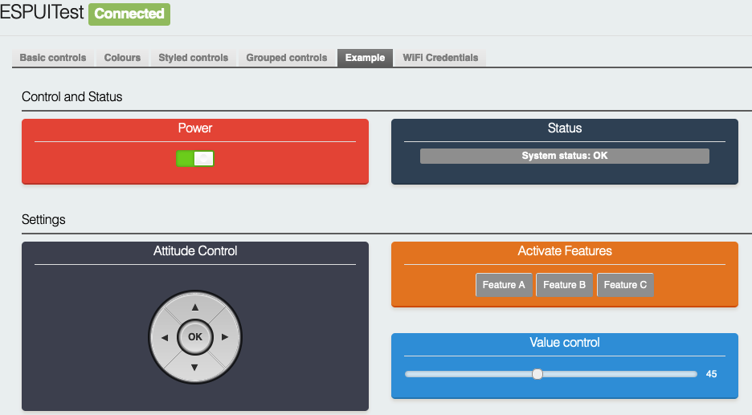

WebSocket_GUI is a set of 4 classes allowing you to quickly create a web-based user interface, to be run on devices such as phones or tablets. It is designed to control status (such as enable/disable automatic mail processing, show job status, etc) for the whole company, shared with several simultan users.
All are seeing the same data and modifying the same - it is designed for global status, not for user specific data, such as addresses, customers, invoices.

Scroll through the documentation from the original project, to see what is possible.

This is the documentation from ESPUI project. I replaced in the docu "ESPUI" with "WebSocket_GUI" and modified code examples from C++ to 4D code.

## WebSocket_GUI

- [Dependencies](#dependencies)
- [How to Install](#how-to-install)
- [Getting started](#getting-started)
- [UI Elements](#documentation)
  * [Button](#button)
  * [Switch](#switch)
  * [Buttonpad](#buttonpad)
  * [Labels](#labels)
  * [Slider](#slider)
  * [Number Input](#number-input)
  * [Text Input](#text-input)
  * [Date, Time, Colour and Password Input](#date-time-colour-and-password-input)
  * [Select control](#select-control)
  * [Getting the Time](#getting-the-time)
  * [Separators](#separators)
- [Initialisation of the UI](#initialisation-of-the-ui)
- [Tabs](#tabs)
- [Log output](#log-output)
- [Colours](#colours)
- [Advanced Features](#advanced-features)
  * [Dynamic Visibility](#dynamic-visibility)
  * [Inline Styles](#inline-styles)
  * [Disabling Controls](#disabling-controls)
  * [Grouped controls](#grouped-controls)
  * [Wide controls](#wide-controls)
  * [Graph (Experimental)](#graph--experimental-)


## Dependencies

The classes are using Web Socket Server, which itself uses 4D's HTTP/Web Server.
To use them, you need 4D v20 (or newer) and a 4D Web Server license.

The project is designed to be directly copied into your code (just 4 classes) to avoid needing another component for only 4 classes. This requires that your application is in project mode. If you still use binary mode, the code could be configured to be compiled as component and to share those classes (but I did not tested that).

## How to Install

Copy the 4 classes (UI, UI_Control, UI_WSConnectionHandler and UI_WSSHandler into your class folder).
Create methods to be used for callback or as worker, follow the example of "GUI_worker" or "mycallback".

Copy the WebFolder folder content (subfolders css and js as well as file "index.html") in your WebFolder.

You might rename index.html to anything else, such as "status.html", this will be the way to access the side. To use it as main access, keep index.html.

The Web Socket Server will listen on "/ws". If needed, you can change that in class UI, line 29, function begin and in file "Controls.js", function start.


## User interface Elements

- Label
- Button
- Switch
- Control pad
- Slider
- Text Input
- Date, Time, Colour and Password Input
- Numberinput
- Option select
- Separator
- Time
- Graph (partial implementation)


## Documentation

The heart of WebSocket_GUI is [4D Web Socket Server](https://developer.4d.com). The frontend is based on [Skeleton CSS](http://getskeleton.com/) and jQuery-like lightweight [zepto.js](https://zeptojs.com/) for handling events. The communication between 4D and the client browser works using web sockets. 
<br><br>
WebSocket_GUI launches a Web Socket Server, which will stay alive as long as the class instance is existing. To keep that existing even when your method is finished, it is advised to run the initalizing (and any modification) inside a worker, which can use it's own global variables, which will stay alive as long as the worker exists.

In the example the method `test` calls the worker GUI_worker

To create a button and a number entry, use:
```4d
gui:=cs.UI.new()
$buttonid:=gui.button("Push Button"; Formula(mycallback))
$numberid:=gui.number("A number"; Formula(mycallback); gui.controlTypes.Sunflower; 50; 1; 100)
gui.begin("very simple UI")
```
		
Clicking or releasing the button will call the method `mycallback`. Similar for entering any number in the second control, which additionally has an assigned color, a start value and a min/max range.

A minimized callback method could just open an alert for any event:
```4d
#DECLARE($control : Integer; $type : Integer; $value : Text; $clientID : Integer; $userdata : Object)
ALERT("Control: "+String($control)+" type: "+String($type)+" value: "+$value)
```

The callback receives the control id (which is the same id as returned when creating a control), event type (such as click or release a button), a value (for controls allowing to enter or modify a value), the client id doing the job (several devices such as phones could be connected at the same time) and finally an optional userdata object (passed when creating the control to exchange data).

The code includes two examples for handling events. Take a look at `mycallback` and `mycallback_generic`.

The events returns numbers for each event type, to ease coding a list of constants is included in `gui.controlTypes.xxx`, such as `gui.controlTypes.B_DOWN` or for colors `gui.controlTypes.Sunflower`.

#### Button

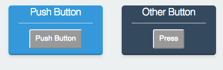

Buttons have a name and a callback value. Their text can be changed at runtime using `gui.updateButton()`.

Events:
- `B_DOWN` - Fired when button is pressed.
- `B_UP` - Fired when button is released.

Reminder, control event type constants available as `gui.controlTypes.B_DOWN`.

#### Switch

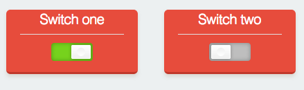

Switches sync their state on all connected devices. This means when you change
their value (either by pressing them, or programmatically using `GUI.updateSwitcher()`) they change visibly 
on all tablets or computers that currently display the interface.

Events:
- `S_ACTIVE` - Fired when turning on.
- `S_INACTIVE` - Fired when turning off.

#### Buttonpad

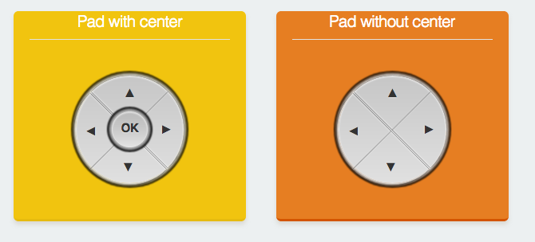

Button pads come in two flavours: with or without a center button. They are
useful for controlling movements of vehicles/cameras etc. They use a single 
callback per pad and have 8 or 10 different event types to differentiate the 
button actions.

- `P_LEFT_DOWN`
- `P_LEFT_UP`
- `P_RIGHT_DOWN`
- `P_RIGHT_UP`
- `P_FOR_DOWN`
- `P_FOR_UP`
- `P_BACK_DOWN`
- `P_BACK_UP`
- `P_CENTER_DOWN`
- `P_CENTER_UP`

#### Labels

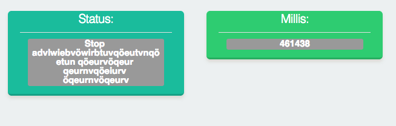

Labels are used to display textual information (i.e. states, values of sensors, 
configuration parameters etc.). To send data from the code use `GUI.updateLabel()` . 
Labels get a name on creation and a initial value.

Labels automatically wrap your text. If you want them to have multiple lines use
the normal `<br>` tag in the string you print to the label.

In fact, because HTML can be used in the label's value, you can make a label display
images by including an `` tag. 

```
 gui.label("An Image Label"; gui.controlTypesPeterriver; "")
```

This requires that the client has access to the image in question, either from the internet or a local web server.


#### Slider

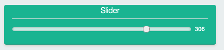

Sliders can be used to select (or display) a numerical value. Sliders provide
realtime data and are touch compatible. Note that like all WebSocket_GUI functions, the callback does not return an `int` 
but a `Text` so should be converted with the `Num()` function. See the examples for more details. Sliders can
be updated from code using `gui.updateSlider()`.

A slider usually only sends a new value when it is released to save network bandwidth. 
This behaviour can be changed globally by setting `sliderContinuous` before `begin()`:

```
gui.sliderContinuous := true
gui.begin("UI Control")
```

Events:
 - `SL_VALUE` - Fired when a slider value changes.

#### Number Input

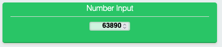

The number input can be used to receive numbers from the user. You can
enter a value into it and when you are done with your change it is sent to the
Server. A number box needs to have a min and a max value. To set it up just use:

`gui.number("Numbertest"; Formula(mycallback); gui.controlTypes.Emerald; 5; 0; 10)`

Number inputs can be updated from code using `gui.updateNumber()`.

Note that HTML number boxes will respect their min and max when the user
clicks the up and down arrows, but it is possible on most clients to simply type 
any number in. As with all user input, numbers should be validated in callback code
because all client side checks can be skipped. If any value from the UI might
cause a problem, validate it.

Events:
 - `N_VALUE` - Fired when a number value changes.


#### Text Input

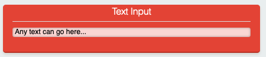

The text input works very similar like the number input but allows any string to be entered. 
If you attach a Max control to the text input then a max length will be applied
to the control. 

```
$text = gui.text("Label"; Formula(mycallback); gui.controlTypes.Emerald; "Initial value");
gui.addControl(gui.controlTypes.Max; ""; "32"; gui.controlTypes.None; $text);
```

Text inputs can be updated from code using `gui.updateText()`.

However even with a set maximum length, user input should still be validated 
because it is easy to bypass client-side checks. Never trust user input.

Events:
 - `T_VALUE` - Fired when a text value changes.


#### Date, Time, Colour and Password Input

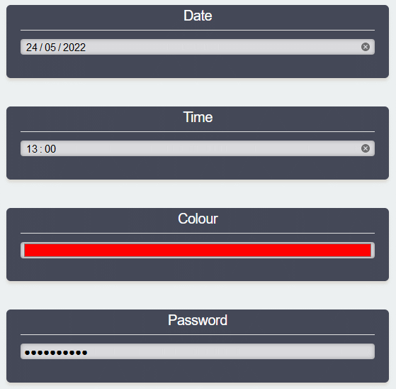

As an extension to the text input control, you can also specify the type attribute to be used for the HTML input element.
This allows you to easily create input controls for Date, Time, Colour and Passwords, or indeed any other
[HTML Input Types](https://www.w3schools.com/html/html_form_input_types.asp) supported by your browser. 

```
$text_date = gui.text("Date"; Formula(mycallback); gui.controlTypes.Dark; "2022-05-24")
gui.setInputType($text_date; "date")

$text_time = gui.text("Time"; Formula(mycallback); gui.controlTypes.Dark; "13:00")
gui.setInputType($text_time; "time")

$text_colour = gui.text("Colour"; Formula(mycallback); gui.controlTypes.Dark; "#FF0000")
gui.setInputType($text_colour; "color")

$text_password = gui.text("Password"; Formula(mycallback); gui.controlTypes.Dark; "tiddles123")
gui.setInputType($text_password; "password")
```

*Important!* This function should be called _before_ `gui.begin` or results will be unreliable.

Note that not all browsers support all input types, and that the control displayed to edit the input is browser dependent.

However even with a type set, user input should still be validated 
because it is easy to bypass client-side checks. Never trust user input.


#### Select control

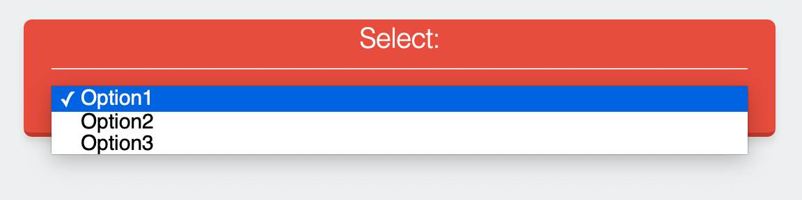
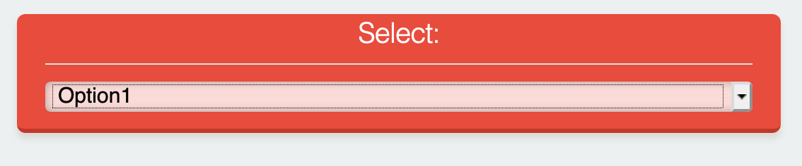

The Select control lets the user select from a predefined list of options. First create a select widget like so

```
$select1 = gui.addControl( gui.controlTypes.Select; "Select Title"; "Initial Value"; gui.controlTypes.Alizarin; $tab1; Formula(mycallback) )
```

Then add Options to it, specifying the Select as the parent:

```
gui.addControl( gui.controlTypes.Option; "Option1"; "Opt1"; gui.controlTypes.Alizarin; $select1)
gui.addControl( gui.controlTypes.Option; "Option2"; "Opt2"; gui.controlTypes.Alizarin; $select1)
gui.addControl( gui.controlTypes.Option; "Option3"; "Opt3"; gui.controlTypes.Alizarin; $select1)
```

Check the example for a working demo. Selectors can be updated from code using `gui.updateSelect()`.

Events:
 - `S_VALUE` - Fired when a select value changes.


#### Separators

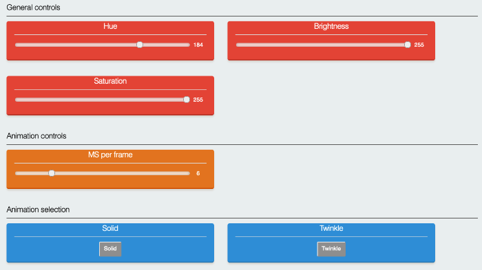

You can use separators to break up the UI and better organise your controls. Adding a separator will force any following controls onto the subsequent line. Add separators as follows:

```
gui.separator("Separator name")
```

Separators fire no events.

### Initialisation of the UI

After all the elements are configured, call `gui.begin("Some Title");`
to start the UI interface. 
The web interface can then be used from multiple devices at once and
also shows connection status in the top bar.


### Tabs

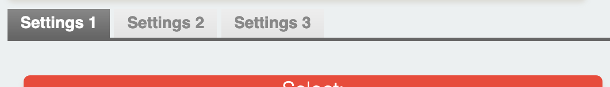

Tabs can be used to organize your controls into pages. Check the example to see 
how this is done. Tabs can be created as follows:

```
$tab:=gui.addControl(gui.controlTypes.Tab; "Settings 1"; "Settings 1")
```

Then all widgets for the tab need to be added to it by specifying the tab as the parent. Widgets not 
added to a tab will be shown above the tab selctor.

```
gui.addControl(gui.controlTypes.Text; "Text Title"; "a Text Field"; gui.controlTypes.Alizarin; $tab1; Formula(mycallback))
```

Note that the basic functions to add controls like `gui.button()` or `gui.slider()` do not add to any tab, 
so they are good for building small UIs. However if you need to use tabs then you will have to add all your
controls using the full `gui.addControl()` function.


### Log output

For debugging the class itself, you might want to enable a log.
To do so, modify the class UI constructor, which starts with `This.verbosity:=false`.
Change that to `true`.
By default it will create a log in the logs folder, near the data folder, named `UIClasslog.txt`.
If you want a different position/name, you might pass a 4D.FileHandler as parameter when you create the UI instance.

### Colours

A selection of basic colours are available to use:

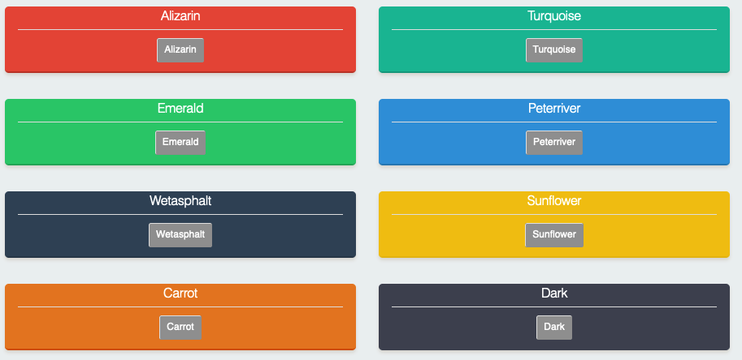

If you want more control over the UI design, see the Inline Styles section below.


## Advanced Features

It includes a range of advanced features that can customise your UIs.


### Dynamic Visibility

Controls can be made visible or invisible at runtime with the `updateVisibility()` function.

```
gui.updateVisibility(controlId; false)
```

Note that you cannot hide individual controls from a [control group](#grouped-controls), you have to hide the entire group.


### Inline Styles

You can add custom CSS styles to controls. This allows you to style the UI with custom colors, drop shadows, 
or other CSS effects. Add styles with the following functions:

```
gui.setPanelStyle($id; style)
gui.setElementStyle(id; style)
```

A panel style is applied to the panel on which the UI element is placed, an element style is applied to the element itself. 
Because CSS inline styles can only style one specific DOM element, for controls made up of multiple elements (like the pad) 
this is limited. Element styles can be applied to all controls, but will only work correctly for the Button, Label, Slider, 
Switcher, Number, Text, and Selector. 

Dynamic update of styles is supported. When either of the above functions are called, the control is updated live. This could 
be used to refect a warning state by changing the color of a button, or for similar effects.

For example, this code will set a control's panel to blue background color:

```
gui.setPanelStyle($switch1, "background-color: blue;")
```

You can get quite creative with this.

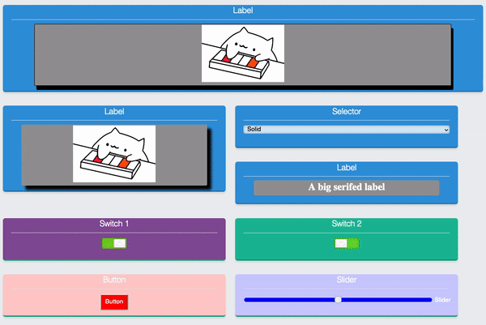

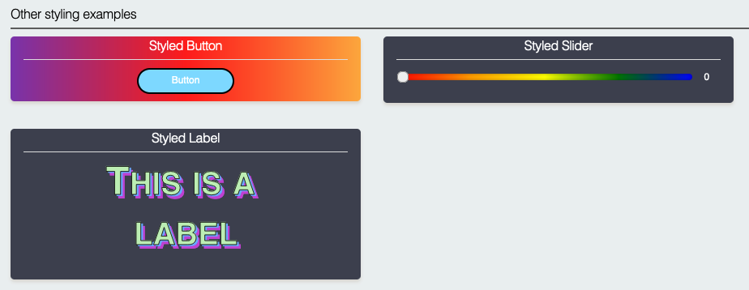


### Disabling Controls

It is possible to dynamically enable and disable controls to, for example, provide feedback to the user that a particular feature is 
temporarily unavailable. To do this use the following function call:

```
gui.setEnabled($controlId; $enabled)
```

Setting `enabled` to false will make the control noninteractive and it will visually change to illustrate this to the user. The control
will stop firing any events. Note that whilst the widget will change appearance, the panel of the control will remain whatever colour 
it was set to. If you wish to also change the colour of the panel then you should use inline styles to show the noninteractive state. For example:

```
gui.setEnabled($mainButton; false)
$disabledstyle = "background-color: #bbb; border-bottom: #999 3px solid;"
gui.setPanelStyle($mainButton; $disabledstyle);
```

This CSS style sets the panel background and its border to grey. To put the control back to enabled use the following:

```
gui.setEnabled($mainButton; true)
gui.setPanelStyle($mainButton; ";")
```

Note that we have to set the inline style to `";"` (i.e. an empty CSS rule) because if we just try to set it to `""` this will be 
interpreted as "do not change the style".

Controls can also be set to disabled before the UI is started.

### Grouped controls

Normally, whenever a control is added to the UI, a new panel is generated with a title. However, you can instead 
set the "parent" of a new control to be an existing control. This allows you to add multiple widgets into the same 
panel. For example:

```
$panel1 = gui.addControl(gui.controlTypes.Button, "Button Set", "Button A", gui.controlTypes.Turquoise, -1, Formula(mycallback))
gui.addControl(gui.controlTypes.Button, "", "Button B", gui.controlTypes.None, $panel1, Formula(mycallback))
gui.addControl(Cgui.controlTypes.Button, "", "Button C", gui.controlTypes.None, $panel1, Formula(mycallback))
```

The first call to `addControl` has no parent (or it could be set to a tab if you are using a tabbed UI), so therefore a new panel is added containing one button
with the value `Button A`. The two subsequent calls have their parent set to the first control we added, so instead of creating
a new panel, the result is the following:

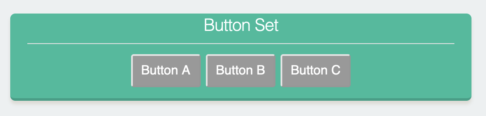

The grouped controls operate entirely independently, and can be assigned different callbacks, or updated separately. The grouping 
is purely visual.

Most controls can be grouped this way, but the result is not always visually pleasant. This works best with labels, sliders, switchers,
and buttons.

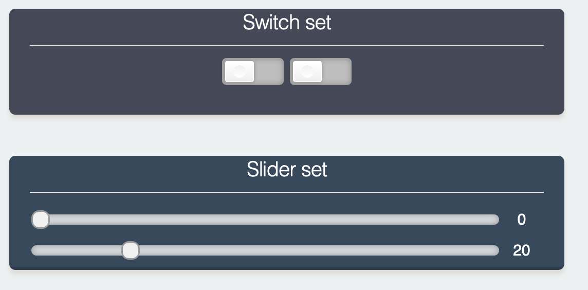

For sliders and switchers, you can also set the controls to be displayed vertically.

```
$vertswitcher = gui.addControl(gui.controlTypes.Switcher, "Vertical Switcher", "0", gui.controlTypes.Dark, $tab1);
gui.setVertical($vertswitcher); 
```

This must be done before `gui.begin()` is called. Vertical layouts are only supported for sliders and switchers, and it 
is a purely visual change. Behaviour is identical. Mixing horizontal and vertical controls can result in some unpredictable layouts.

When you add multiple buttons to a single panel, the buttons have a title so they can be differentiated. For sliders and switchers this is
not the case. Therefore you might want to add additional labels so that the controls can be distinguished. There is not yet automatic 
support for doing this, so the approach is to add labels that have been styled using [inline styles](#inline-styles). By doing this 
you can acheieve effects such as this:

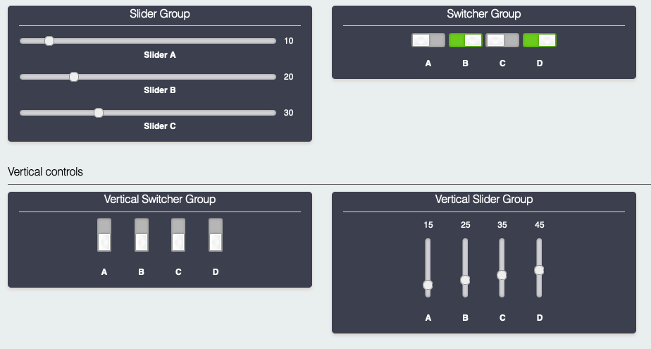


### Wide controls

Controls can be set to be displayed "wide" with the function:

```
gio.setPanelWide($controlid; true)
```

*Important!* This function should be called _before_ `gui.begin` or results will be unreliable.

Setting a control to wide tells UI to lay out that control as if there was only a single column, even on wide displays. 
This can be applied to every element to force a single column layout, or to individual elements to customise the display.

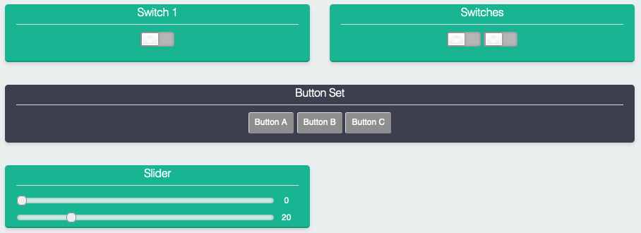

Note that this will have no effect on small screens.


### Graph (Experimental)

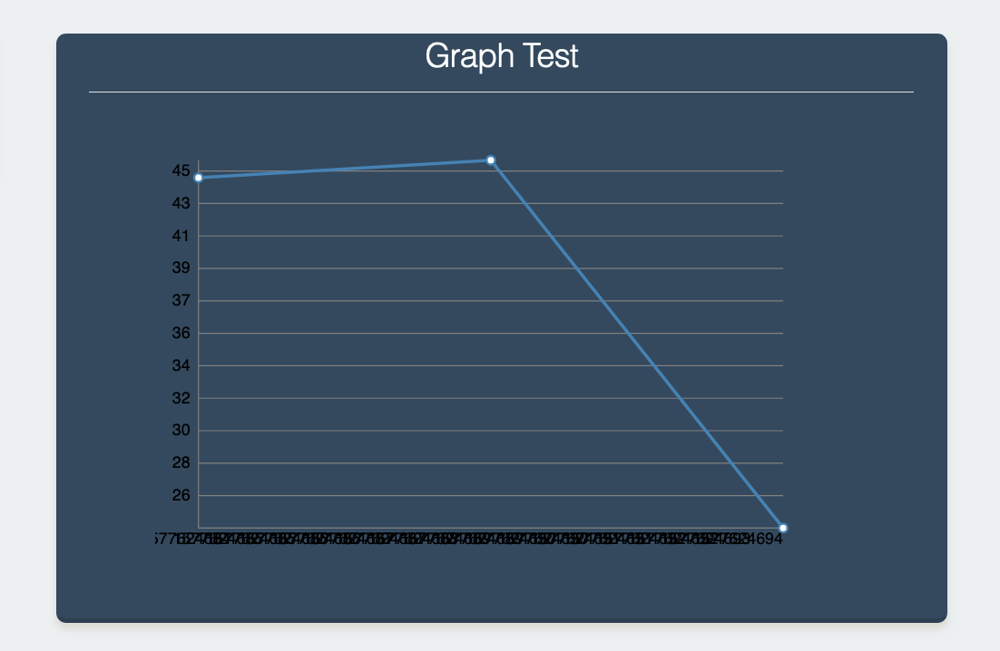

The graph widget can display graph points with timestamp at wich they arrive

Use `gui.addGraphPoint($graphId; random%50);` to add a new value at the current time, use `gui.clearGraph($graphId)` to clear the entire graph.
Graph points are saved in the browser in **localstorage** to be persistant, clear local storage to remove the points or use clearGraph() from a button callback to provide a clear graph.

_There are many issues with the graph component currently and work is ongoing. The EPSUI library might be updated and then code changes would need to be ported to this clone_

